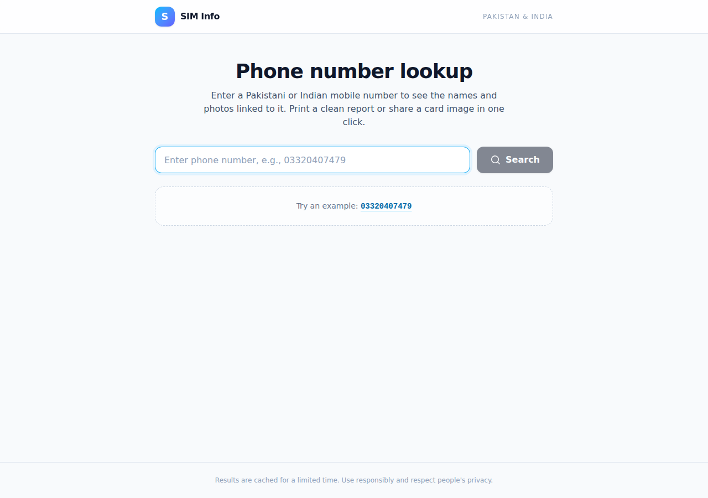
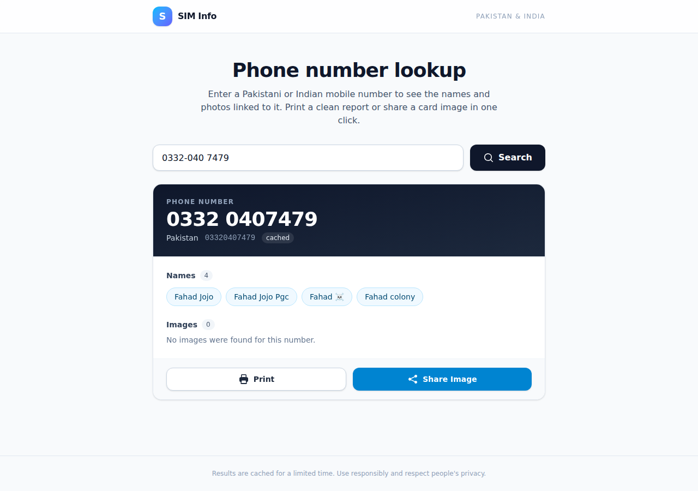
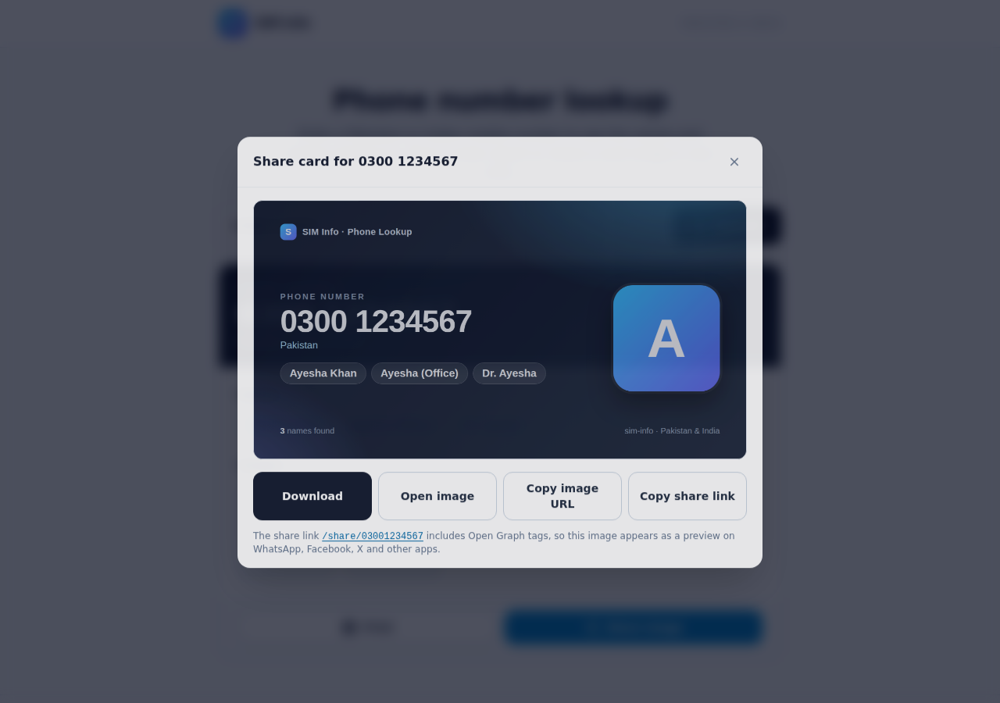
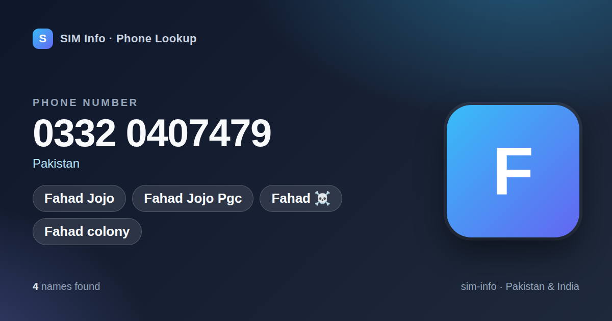

# SIM Info · Phone Number Lookup

A full‑stack web app for looking up Pakistani and Indian phone numbers through the
`7u6959.af7u76.workers.dev` lookup API. It shows the names and photos linked to a
number, produces a clean printable report, and generates a shareable
1200×630 social‑card image with Open Graph metadata.

| Search | Result |
| --- | --- |
|  |  |

| Share modal | Generated social card (`/image/:number`) |
| --- | --- |
|  |  |

More screenshots (mobile layout, print page) are in [`docs/screenshots`](docs/screenshots).

## Features

- **Search** – enter a number in any format (`0332-040 7479`, `+92 332 0407479`); the
  app strips everything except digits before calling the API.
- **Result card** – phone number, every name as a badge, image thumbnails with a lightbox.
- **Print** – `/print/:number` is a minimal server‑rendered page with `@media print`
  rules (A4 page setup, large type, no chrome). Add `?auto=1` to open the print dialog
  automatically.
- **Share image** – `/image/:number` renders a branded 1200×630 PNG with headless
  Chrome (Puppeteer). `/share/:number` wraps it in a page with Open Graph / Twitter
  card tags so links unfurl with the image on WhatsApp, Facebook, X, Slack, etc.
- **Caching** – lookup results are cached for 7 days (Redis if `REDIS_URL` is set,
  otherwise in‑memory `node-cache`). Generated images are cached on disk and in memory.
- **Rate limiting** – 10 lookups / minute / IP by default, with a separate budget for
  the page and image routes. Clients receive standard `RateLimit-*` headers.
- **Resilience** – upstream timeouts, 5xx responses and malformed JSON become
  structured `{ status: "error", code, message }` responses; concurrent lookups of the
  same number are coalesced into one upstream call.
- **Security** – strict input validation, Helmet security headers with a CSP,
  EJS auto‑escaping, optional CORS allow‑list, no `x-powered-by`.
- **Logging** – JSON lines on stdout; each lookup (number, timestamp, client IP) can
  also be appended to `LOG_FILE` for analytics.

## Tech stack

| Layer | Choice |
| --- | --- |
| Backend | Node.js 22, Express 5, EJS templates |
| Frontend | React 19, Vite 7, Tailwind CSS 4 |
| Cache | Redis (ioredis) or in‑memory `node-cache` |
| Images | Puppeteer (`puppeteer-core`) + system Chromium |
| Deployment | Vercel (serverless, `api/index.js` + `vercel.json`) or Dockerfile + `docker-compose.yml` with Redis |

## Project layout

```
.
├── client/                 # React SPA (Vite + Tailwind)
│   └── src/
│       ├── App.jsx         # search flow, state, modals
│       ├── components/     # SearchForm, ResultCard, ShareImageModal, Lightbox, ErrorBanner
│       └── lib/            # api.js (fetch wrapper), phone.js (formatting)
├── server/
│   ├── src/
│   │   ├── index.js        # entry point (boot, graceful shutdown)
│   │   ├── app.js          # Express app factory (helmet, routes, static, SPA fallback)
│   │   ├── config.js       # .env parsing
│   │   ├── routes/         # api.js (/api/lookup), pages.js (/print, /share), image.js (/image)
│   │   ├── lib/            # lookup client, cache, Puppeteer renderer, phone utils, logger
│   │   └── middleware/     # rate limiters
│   ├── templates/          # print.ejs, share.ejs, card.ejs (social card), error.ejs
│   ├── public/             # print.css, print.js
│   └── test/               # node:test suites
├── api/index.js            # Vercel serverless entry (wraps the Express app)
├── docs/screenshots/
├── Dockerfile
├── docker-compose.yml
├── vercel.json
└── .env                    # sample configuration (edit for local / Docker use)
```

## Quick start (local)

Requirements: Node.js 22 and a Chrome/Chromium binary for image generation
(auto‑detected on Linux/macOS/Windows in the usual locations; otherwise set
`PUPPETEER_EXECUTABLE_PATH`).

```bash
git clone <this repo> && cd sim-info
# edit .env if needed (it ships with sensible defaults)
npm install                   # installs server + client workspaces

# Development: Express on :3000 and Vite dev server on :5173 (with API proxy).
# The server runs in development mode here regardless of NODE_ENV in .env.
npm run dev
# open http://localhost:5173

# Production build: bundle the client, then serve everything from Express
npm run build
npm start
# open http://localhost:3000
```

If you cannot reach the upstream API (or want deterministic data), set
`LOOKUP_MOCK=true` in `.env`. The mock knows `03320407479`, `03001234567` and
`919876543210`; any other number returns an empty result.

### Tests

```bash
npm test                 # unit + HTTP integration tests (mock upstream, no browser needed)
TEST_IMAGE=1 npm test    # also renders a real PNG with Chromium
```

## Deploying to Vercel

The repo deploys to Vercel with either **Root Directory** setting. Both layouts were
verified with a local `vercel build` and Vercel's own function launcher logic.

**Option A – Root Directory = repository root (recommended).** `vercel.json` pins the
framework preset to *Other*, builds the React client to `client/dist` as static files,
and rewrites every other path (`/api/*`, `/print/*`, `/share/*`, `/image/*`) to one
serverless function, `api/index.js`, which exports the Express app.

**Option B – Root Directory = `server`.** `server/vercel.json` pins the Express preset
(Vercel would also auto-detect it), whose entrypoint is `server/src/app.js` (its default
export is the app). `server/vercel.json` installs and
builds from the repository root, and the function serves the SPA itself. Two project
settings must keep their defaults: *Include source files outside of the Root
Directory* enabled, and *Output Directory* blank (a non-empty value makes the Express
preset look for its entrypoint there).

Either way:

1. Import the GitHub repo in Vercel and keep the settings above. Do **not** pick a
   different framework preset by hand.
2. Add environment variables under Project → Settings → Environment Variables. The
   committed `.env` file is for local and Docker runs only: the server skips it on
   Vercel/Lambda (and never bundles it), so anything you need there must be set in
   the dashboard. Recommended:

   | Variable | Value |
   | --- | --- |
   | `REDIS_URL` | A hosted Redis URL (e.g. Upstash `rediss://…`). Without it each function instance keeps its own in‑memory cache, so cache hits are rare and the 7‑day TTL is not meaningful. |
   | `LOOKUP_API_URL` | Optional override of the upstream API |
   | `PUBLIC_BASE_URL` | Optional; leave unset and the request's host is used for `og:image` |

3. Deploy. Image cards are rendered with
   [`@sparticuz/chromium`](https://github.com/Sparticuz/chromium), a Chromium build
   for Lambda‑style runtimes, extracted to `/tmp` on the first render (a cold render
   takes roughly 4–6 s, later ones under a second). Generated PNGs are cached in `/tmp`
   per instance. Emoji, Arabic and Devanagari fonts are downloaded to `/tmp/fonts` on
   cold start (the Lambda Chromium only ships Open Sans); set `CARD_FONT_URLS` to an
   empty string to skip that.

Notes for serverless: `NODE_ENV` defaults to `production` there, and the Node.js
version comes from `engines` (22.x) in both layouts. The function entrypoints export the Express app synchronously
(Vercel's launcher needs a function export or a `listen()` call at import time) and the
cache backend connects on the first request. `TRUST_PROXY` defaults to `1`,
`IMAGE_CACHE_DIR` and `LOG_FILE` are only honoured under `/tmp`, and `.env` files are
skipped whenever `VERCEL` or an AWS Lambda variable is present. Rate limits are per
function instance. Both layouts set `maxDuration` to 60 s; a cold image render
(Chromium extraction, browser launch, font downloads) takes roughly 5 s. If a font
download fails, cards are still served but not cached; the download is retried in the
background after five minutes (`CARD_FONT_RETRY_MS`), the browser is swapped for a
fresh one once the font arrives, and a URL that keeps failing is given up on after
three attempts so caching resumes with the fonts that did load. The
install commands pass `--include=dev` so a `NODE_ENV=production` build variable
cannot skip the client's build tooling.

If a deployment shows `FUNCTION_INVOCATION_FAILED`, open the deployment's *Functions*
log in the Vercel dashboard: the first log line names the thrown error.

## Docker

```bash
# edit .env as needed
docker compose up --build -d
# open http://localhost:3000
```

The compose file starts the app plus a Redis container (`REDIS_URL` is set for you)
and persists generated images and Redis data in named volumes. The image bundles
Debian's Chromium and Noto fonts (including colour emoji, which appear in names such
as `Fahad ☠️`).

Run without Redis:

```bash
docker build -t sim-info .
docker run --rm -p 3000:3000 --shm-size=512m --env-file .env sim-info
```

Behind a reverse proxy (nginx, Caddy, Cloudflare), set `TRUST_PROXY=1` so the rate
limiter and logs see the real client IP, and set `PUBLIC_BASE_URL` to your public
origin so `og:image` URLs are absolute.

## Configuration

All settings live in [`.env`](.env) for local and Docker runs; on Vercel use the
project's environment variables instead.

| Variable | Default | Description |
| --- | --- | --- |
| `PORT` | `3000` | HTTP port |
| `NODE_ENV` | `development` (`production` on Vercel/Lambda) | `production` precompiles templates once and sends long cache headers for static assets; in development templates and `print.css` are re-read on every request. `npm run dev` always forces `development` |
| `TRUST_PROXY` | `0` (`1` on Vercel/Lambda) | Express `trust proxy` setting (`1`, `true`, or a list like `loopback, 10.0.0.0/8`) |
| `PUBLIC_BASE_URL` | request origin | Absolute origin used in Open Graph tags |
| `CORS_ORIGIN` | empty | Comma‑separated origins allowed to call `/api` cross‑origin |
| `LOOKUP_API_URL` | `https://7u6959.af7u76.workers.dev/` | Upstream API |
| `LOOKUP_TIMEOUT_MS` | `10000` | Upstream request timeout |
| `LOOKUP_MOCK` | `false` | Serve fixture data instead of calling upstream |
| `CACHE_TTL_SECONDS` | `604800` (7 days) | Lookup result TTL |
| `REDIS_URL` | empty | e.g. `redis://redis:6379`; empty = in‑memory cache |
| `IMAGE_CACHE_DIR` | `./cache/images` (`/tmp/sim-info-images` on Vercel/Lambda) | Where PNG cards are stored |
| `IMAGE_CACHE_TTL_SECONDS` | `604800` | Image TTL |
| `IMAGE_CACHE_MAX_FILES` | `200` | Cap on cached PNG files on disk, oldest evicted first (`0` = unlimited) |
| `RATE_LIMIT_WINDOW_MS` | `60000` | Rate‑limit window |
| `RATE_LIMIT_MAX` | `10` | Lookups per window per IP |
| `IMAGE_RATE_LIMIT_MAX` | `20` | `/image`, `/print`, `/share` requests per window per IP |
| `PUPPETEER_EXECUTABLE_PATH` | auto‑detect | Chrome/Chromium binary |
| `IMAGE_RENDER_CONCURRENCY` | `2` | Max simultaneous headless renders |
| `CARD_FONT_URLS` | Noto Color Emoji, Noto Sans Arabic, Noto Sans Devanagari (GitHub) | Serverless only: fonts downloaded to `/tmp/fonts` at cold start so emoji, Urdu and Hindi names render on cards; empty disables |
| `CARD_FONT_RETRY_MS` | `300000` | Serverless only: wait before retrying a failed font download; a successful retry relaunches the browser so the fonts take effect |
| `LOG_FILE` | empty | Append lookup analytics as JSON lines to this file (on Vercel/Lambda only paths under `/tmp` are honoured) |

## HTTP API

### `GET /api/lookup?number=<phone>`

Cleans the input (digits only, 7–15 digits), serves from cache when possible, otherwise
calls the upstream API and caches the normalised result.

```json
{
  "status": "ok",
  "number": "03320407479",
  "names": ["Fahad Jojo", "Fahad Jojo Pgc", "Fahad ☠️", "Fahad colony"],
  "images": [],
  "results": [{ "number": "03320407479", "names": ["..."], "images": [] }],
  "upstreamStatus": "success",
  "fetchedAt": "2026-09-04T19:07:38.441Z",
  "cached": false
}
```

Errors are always JSON:

| HTTP | `code` | When |
| --- | --- | --- |
| 400 | `invalid_number` | Not 7–15 digits after cleaning |
| 429 | `rate_limited` | Too many requests from this IP |
| 502 | `network` / `upstream_error` / `invalid_response` | Upstream unreachable, 5xx, or bad JSON |
| 503 | `upstream_rate_limited` | Upstream returned 429 |
| 504 | `timeout` | Upstream did not answer within `LOOKUP_TIMEOUT_MS` |

### `GET /print/:number`

Print‑optimised HTML (links `/print.css`). `?auto=1` triggers `window.print()` on load.

### `GET /image/:number`

1200×630 PNG social card. `?download=1` adds a `Content-Disposition: attachment`
header. The `X-Image-Cache: hit|miss` header tells you whether it was rendered fresh.

### `GET /share/:number`

HTML page with `og:*` and `twitter:*` tags whose image is `/image/:number`; links back
to the app with the number pre‑filled (`/?number=…`).

### `GET /api/health`

`{ "status": "ok", "cache": "memory" | "redis" | "pending", "time": "…" }` (`pending` until the first lookup on a serverless instance, whose cache connects lazily)

## Notes

- Numbers are looked up exactly as typed (after removing non‑digits). `03320407479` and
  `923320407479` are different cache keys because the upstream API treats them as
  different queries.
- Image rendering opens one shared Chromium instance lazily and reuses it; if it
  crashes it is relaunched on the next request.
- Out of scope, as specified: accounts, batch lookups, analytics dashboards.
